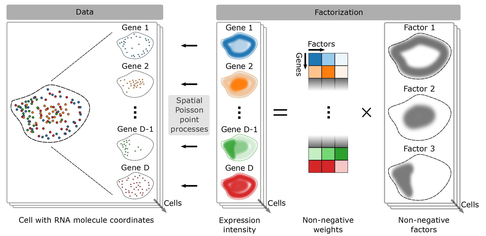

# FISHFactor: A Probabilistic Factor Model for Spatial Transcriptomics Data with Subcellular Resolution
Code repository supplementing the [paper](https://doi.org/10.1093/bioinformatics/btad183).

FISHFactor is a non-negative, spatially informed factor analysis model with a Poisson point process likelihood to model single-molecule resolved data, as obtained for example from multiplexed fluorescence in-situ hybridization methods. In addition, FISHFactor allows to integrate multiple cells by jointly inferring cell-specific factors and a weight matrix that is shared between cells. The model is implemented using the deep probabilistic programming language [Pyro](https://pyro.ai/) and the Gaussian process package [GPyTorch](https://gpytorch.ai/).

## Repository structure
- **src/** contains the FISHFactor model, data simulation and util functions.
- **experiments/** contains the experiments described in the paper.
- **data/** contains scripts to download and process data used in the paper.

## Usage
The required packages can be installed in an Anaconda environment using the environment.yml file. An example for using FISHFactor with simulated cells is shown in *fishfactor_demo.ipynb*.